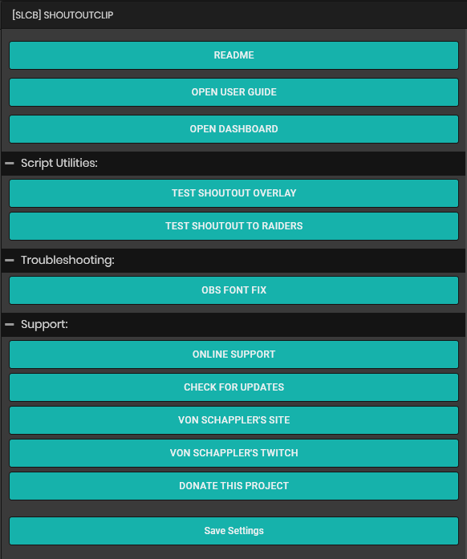
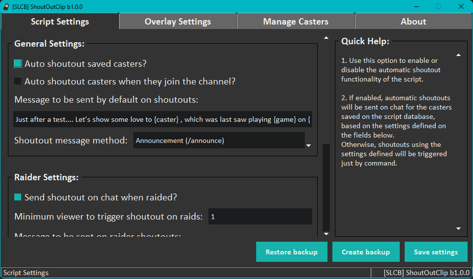
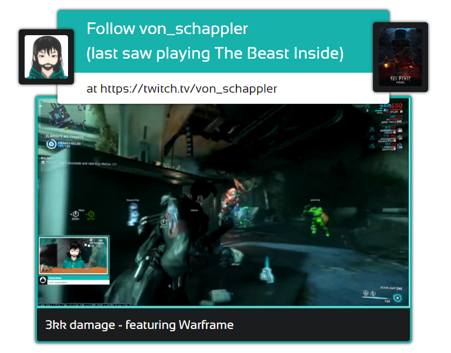

# [SLCB] ShoutOutClip

## Introduction:

This is a Streamlabs Chatbot script which enables the use of a command to display an advertisement for streamers to "shoutout" streamers on their channel, while optionally playing a clip of the shouted/announced channel, with an overlay added to **OBS Studio**.

This script counts with two important external pieces/APIs:

- [Raid-Notify](https://github.com/Kruiser8/Raid-Notify) made by [@Kruiser8](https://github.com/Kruiser8), with some changes to the code in order to fit the script purpose
- [Twitch_Api_Public](https://github.com/teklynk/twitch_api_public) made by [@Tkelynk](https://github.com/teklynk), to retrieve the clip to be played

## Features:

- [x] Graphical User interface to enable settings control of the script and the appearance of the clip shoutout overlay
- [x] Uses sqlite database to store the data to be used on shoutout
- [x] Allows creation of custom messages for each streamer to the be shouted
- [x] Allows control of which streamer to be shouted
- [x] Uses commands to refresh the information saved on the database to enable quick changes on the behavior of the script, removing the necessity of refreshing all the scripts running on **Streamlabs Chatbot**
- [x] Creates log files for both **StreamlabsSystem** script and the **GUI** (aka Dashboard), organized into their specific folders
- [x] Allows auto shouting saved streamers when they send a message on chat, when they join your channel
- [x] Allows aditional shouts using commands
- [x] Allows adjusting other settings for shoutouts, like auto-shout non saved streamers and raiders, as well as auto saving raiders to the database.

### Requirements:

- Windows 10 or above
- Streamlabs Chatbot 1.0.2.81 or above
- OBS Studio 30.0.2 or above

## User guide:

If you are new to **Streamlabs Chatbot** and needs some guidelines on how to setup scripts on it, please refer to their [official documentation](https://cdn.streamlabs.com/chatbot/Documentation_Twitch.pdf).

After following the instructions on how to setup the bot and how to make use of custom scripts, **import** the script and move to our complete user's guide provided on this [wiki](https://github.com/vonschappler/SLCB-ShoutOutClip/wiki/User-Guide).

## Image previews:

### 1. Streamlabs Chatbot GUI:

### 2. Dashboard made with Tkinter:

### 3. Customizable Overlay:

<!-- Other images -->

## Changelog:

- [Version beta-1.2.0](https://github.com/vonschappler/SLCB-ShoutOutClip/releases/tag/beta-1.2.0)

  - Fixed an issue which caused saved casters to be shout out twice when they also raid a channel.

- [Version beta-1.1.0](https://github.com/vonschappler/SLCB-ShoutOutClip/releases/tag/beta-1.1.0)

  - Fixed an issue that prevented the default message triggered on ShoutOuts from being updated on the database
  - Improvements on the Casters Management section of the dashboard:
    - [x] The casters list is now displayed alphabetically

- [Version beta-1.0.0](https://github.com/vonschappler/SLCB-ShoutOutClip/releases/tag/beta-1.0.0)
  - First version launched

## Additional information:

### Issues

#### To Fix:

- [ ] GUI loading time may delay depending on the amount of information added to the database

#### Under investigation:

- [x] Sometimes the clip won't be played on OBS or will play in a muted state - something suggests it's linked to CORS (because the overlay is a local file saved on the users computer) on the overlay and we are working on a fix, **IF POSSIBLE**, to this
- [x] Because the script has external dependencies, IF any of those dependencies simply goes offline for any reason, the script may not work properly.

### TODOS:

- [ ] Find a way to make use of Twitch's own API for selecting a clip to be played in the case of any external libraries stop working

- [ ] Test the script in a real case scenario
  

    
    - Although the script is working as intented with fake data, some tests on real case scenarios is required before releasing the final version of it.

  

